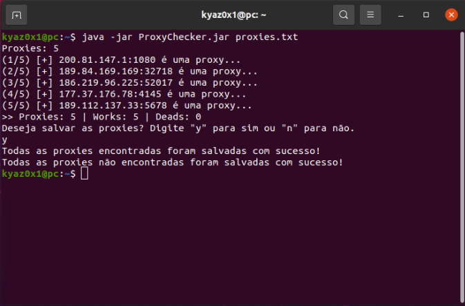

# ProxyChecker
Program to check a list of proxies

#### Example usage:
```
java -jar ProxyChecker.jar <file>
```

#### Output:


### Project information
|Name| ProxyChecker |
|----|--|
|Version|1.0.0|
|Build|b212707|
|Developer|Kyaz0x1|
